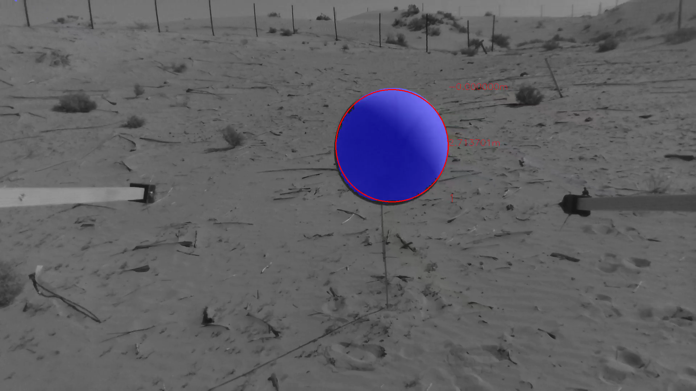

# Object detect

| Build status | [](https://github.com/ctu-mrs/object_detect/actions) |
|--------------|------------------------------------------------------------------------------------------------------------------------------------------|

## OpenCL

Install OpenCL or run /scripts/install_opencl.sh


The Object Detect is a package developed at the MRS group  for detection colorful
round objects, like the one that was used as a target for the MBZIRC 2020 Challenge
one.
The algorithm of the color segmentation and 3d estimation is described in our work that has been accepted to [ICRA2021](ICRA2021).
<p align="center">
  
</p>

## Requirements:
The package is designed together with ROS Noetic and ```mrs_lib```, which is installed together with the [MRS UAV System](https://github.com/ctu-mrs/mrs_uav_system).
The color and size of the desired object is specified in a [config file](config/balls/Red.yaml).
The format of the config file is as follows:
```yaml
ball:
  binarization_method_name: HSV
  hsv: {hue_center: 52.654596807119056, hue_range: 22.608414373005395, sat_center: 99.92753623188406,
    sat_range: 160.25069282432074, val_center: 117.91439449766642, val_range: 925.6251866270163}
  lab: {a_center: 106.46094325718497, a_range: 3.75860395761193, b_center: 149.30987472365513,
    b_range: 11.129277064718911, l_center: 117.29145173176124, l_range: 923.0698135303048}
  physical_diameter: 0.65
  segment_color_name: Green
```
There are four methods of binarizations that object detect can accept:
- HSV - using the HUE, Saturation Value model of the color space with thresholding using mean and variance of the distribution
- L*A*b* - the L* a* B* color space model also using the thresholding
- hs_lut - this method is using a handpicked 2D histogram of the color using the Hue and Saturation distribution  
- ab_lut - this method is using a handpicked 2D histogram of the color using the Hue and Saturation distribution  

The values for the binarization method can be selected using a semi-automatic tool [Color Picker](https://github.com/ctu-mrs/color_picker), which allows to pick color and the histogram in live mode (using the camera topic in ROS).
It also integrates the Object Detect package in it, so you can observe the detections and tune them on the fly.


Authors & Contact
-----------------
```
Matouš Vrba  <vrbamato@fel.cvut.cz> 
Yurii Stasinchuk <stasiyur@fel.cvut.cz>
Multi-Robot Systems mrs.felk.cvut.cz
Faculty of electrical engineering,
Czech Technical University in Prague
```
